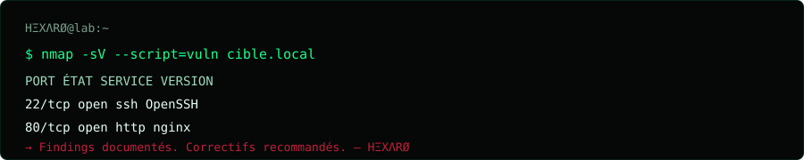

<!--
  GitHub Profile README — juxt-rts-design
  Repo required: https://github.com/juxt-rts-design/juxt-rts-design
-->

<div align="center">

  <!-- Bannière : remplace l'URL après push vers le repo profil -->
  

  <br/><br/>

  ```text
  ????????????????????????????????????????????????????????????
  ?   JUXT-RTS-DESIGN  ·  ETHICAL HACKER  ·  DEVELOPER      ?
  ?   Offensive security mindset · Defensive engineering     ?
  ????????????????????????????????????????????????????????????
  ```

  **I break things so they can't be broken.**  
  Pentest · AppSec · Web · Automation — always within the rules.

  [](https://github.com/juxt-rts-design)
  [](https://github.com/juxt-rts-design?tab=repositories)
  [](https://github.com/juxt-rts-design)
  [](https://github.com/juxt-rts-design)

</div>

---

## `~/whoami`

```bash
$ cat /etc/passwd | grep juxt
juxt-rts-design:x:1337:1337:Ethical Hacker & Developer:/home/juxt:/bin/zsh
```

Développeur et **hacker éthique** — je combine offensive security et craft logiciel pour comprendre, tester et durcir les systèmes.

| Champ | Valeur |
|:------|:-------|
| **Alias** | `juxt-rts-design` |
| **Rôle** | Ethical Hacker · Developer |
| **Focus** | Web AppSec · PHP · Automation · Red Team mindset |
| **Engagement** | Authorized testing only · Responsible disclosure |
| **Stack** | Linux · PHP · Python · Bash · Git · Docker |

---

## `~/arsenal`



### Offensive


### Development


### Domaines

```text
????????????????????????????????????????????????????????????
?  WEB APPSEC     ?  XSS · SQLi · Auth · IDOR · API        ?
?  NETWORK        ?  Recon · Scanning · Service enum       ?
?  SCRIPTING      ?  Python · Bash · PHP automation        ?
?  HARDENING      ?  Secure config · Least privilege       ?
?  REPORTING      ?  Clear findings · Actionable fixes     ?
????????????????????????????????????????????????????????????
```

---

## `~/ops`

<div align="center">

  
  

</div>

<div align="center">

  

</div>

---

## `~/lab`

Projets & labs — sécurité, code, expérimentation.

| Repo | Type | Stack | Status |
|:-----|:-----|:------|:-------|
| [**Librairie**](https://github.com/juxt-rts-design/Librairie) | App | PHP | Public |
| *More labs incoming…* | CTF / Writeups | — | WIP |

> Pin tes meilleurs repos (outils, writeups, labs) pour remplir cette section.

---

## `~/doctrine`

```diff
+ Authorized targets only
+ Document findings clearly
+ Prefer fix over flex
+ Never weaponize for harm
- No illegal access
- No drive-by exploits
- No credential abuse
```

---

## `~/contact`

```bash
$ echo "Open an issue or reach out via GitHub."
# Collaboration · Labs · Responsible disclosure
```

<div align="center">

  [](https://github.com/juxt-rts-design)

  <br/>

  ```text
  [EOF] — stay curious, stay ethical.
  ```

</div>
# Github_design
