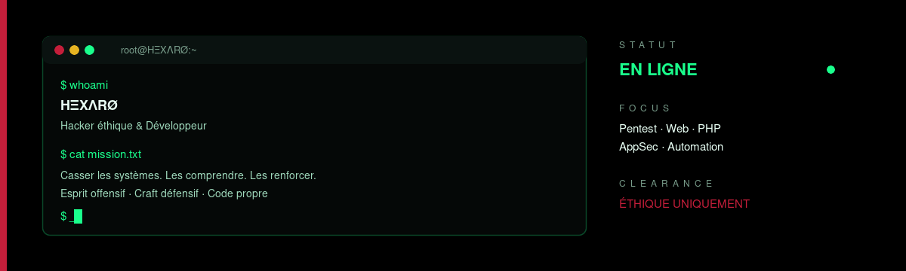
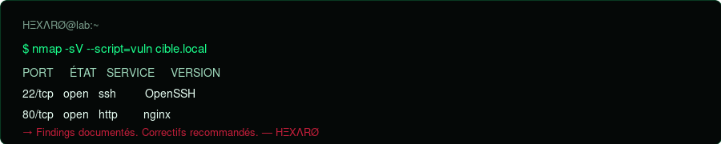

# HΞXΛRØ

<div align="center">
  
</div>

<br/>

<div align="center">

**Hacker éthique / Développeur**

*Je casse les systèmes pour qu'ils ne puissent plus l'être.*

Pentest / AppSec / Web / Automation — toujours dans les règles.

[](https://github.com/juxt-rts-design)
[](https://github.com/juxt-rts-design?tab=repositories)
[](https://github.com/juxt-rts-design)
[](https://github.com/juxt-rts-design)

</div>

---

## ~/whoami

```bash
$ whoami
HΞXΛRØ

$ cat mission.txt
Esprit offensif. Craft défensif. Code propre.
Tests uniquement autorisés. Disclosure responsable.
```

Développeur et **hacker éthique** — j'allie sécurité offensive et craft logiciel pour comprendre, tester et durcir les systèmes.

| Champ | Valeur |
|:------|:-------|
| **Alias** | `HΞXΛRØ` |
| **Rôle** | Hacker éthique / Développeur |
| **Focus** | Web AppSec / PHP / Automation / Red Team |
| **Règle** | Tests uniquement sur cibles autorisées |
| **Stack** | Linux / PHP / Python / Bash / Git / Docker |

---

## ~/arsenal

<div align="center">
  
</div>

### Offensif


### Développement


### Domaines

```text
WEB APPSEC   |  XSS, SQLi, Auth, IDOR, API
RÉSEAU       |  Recon, Scan, Énumération services
SCRIPTING    |  Automation Python, Bash, PHP
DURCISSEMENT |  Config sécurisée, moindre privilège
REPORTING    |  Findings clairs, correctifs actionnables
```

---

## ~/ops

<div align="center">
  
  
</div>

<div align="center">
  
</div>

---

## ~/lab

| Repo | Type | Stack |
|:-----|:-----|:------|
| [Librairie](https://github.com/juxt-rts-design/Librairie) | App | PHP |
| [BOT](https://github.com/juxt-rts-design/BOT) | Outil | JavaScript |
| [Downloader](https://github.com/juxt-rts-design/Downloader) | Outil | JavaScript |
| [DGR](https://github.com/juxt-rts-design/DGR) | Projet | TypeScript |

---

## ~/doctrine

```diff
+ Cibles autorisées uniquement
+ Documenter les findings clairement
+ Préférer le correctif au flex
+ Ne jamais weaponiser pour nuire
- Pas d'accès illégal
- Pas d'exploits drive-by
- Pas d'abus de credentials
```

---

## ~/contact

```bash
$ echo "Ouvre une issue sur GitHub"
# Collab / Labs / Disclosure responsable
```

<div align="center">

[](https://github.com/juxt-rts-design)

`[EOF] — reste curieux, reste éthique. — HΞXΛRØ`

</div>
